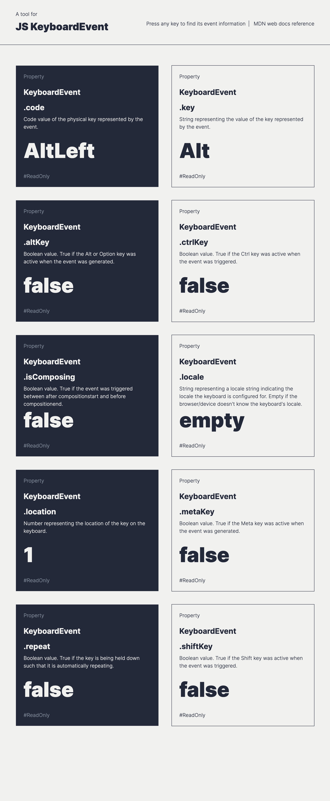

# JS Keyboard Events

JS KeyboardEvent tool captures information about user interaction with the keyboard.

It displays the current properties for the KeyboardEvent object.

**Note**: this tool does not provide information about deprecated properties such as `keycode` or `which`.

## How to use

* Press any key to find the event information